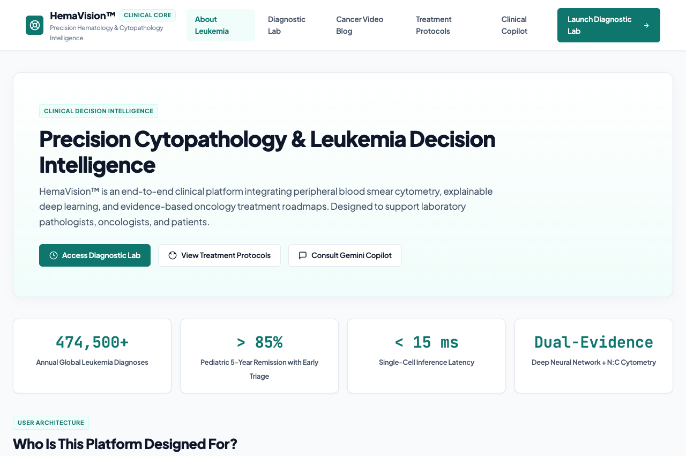
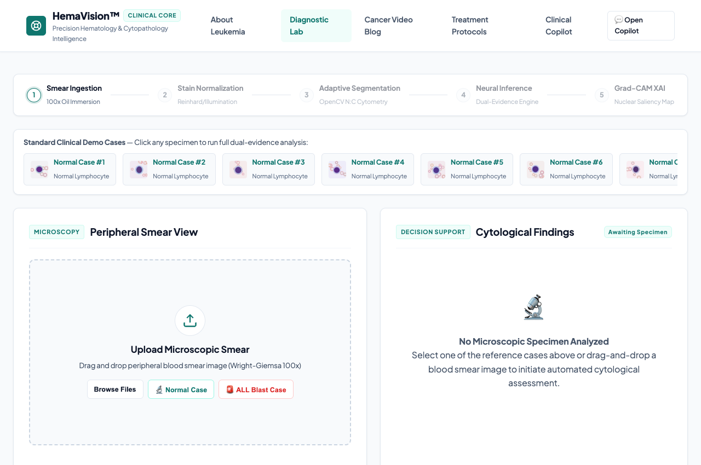
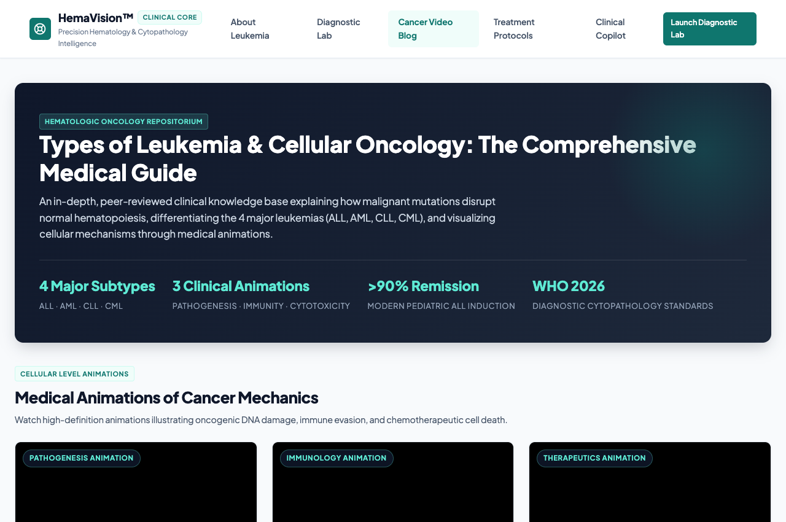
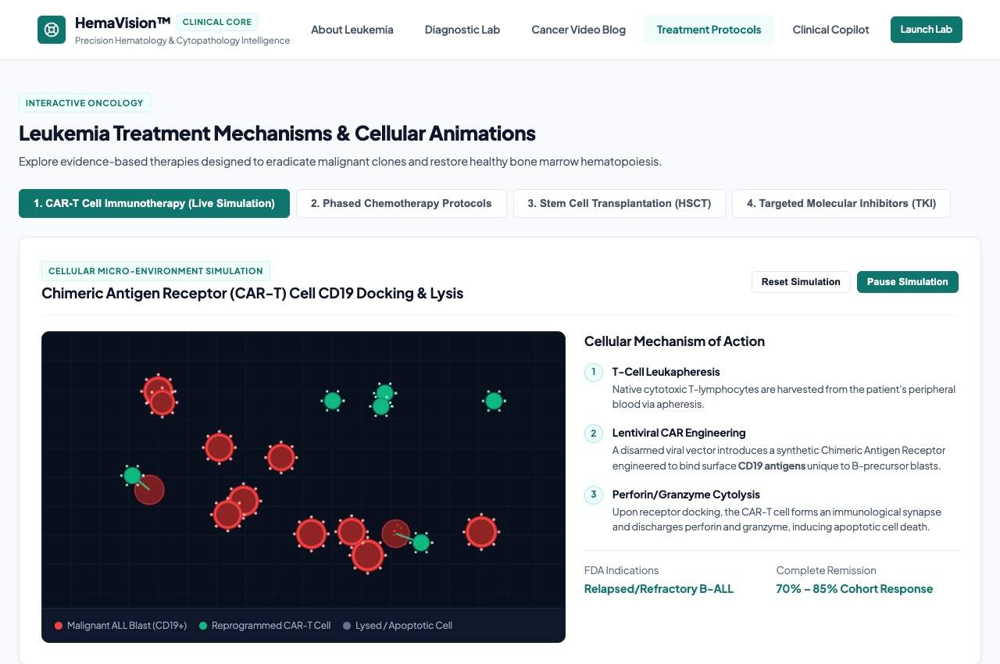
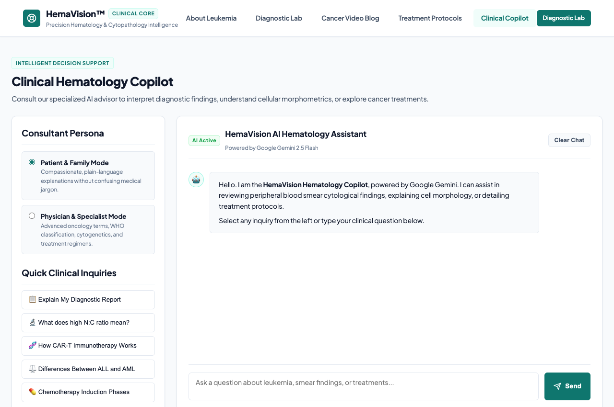

# HemaVision™: Multi-Modal Cytopathological Deep Learning Pipeline for Leukemia Detection

[](https://www.python.org/)
[](https://pytorch.org/)
[](https://fastapi.tiangolo.com/)
[]()
[-97.8%25-success.svg)]()
[](LICENSE)

> **Developed by Rekha Kumari**  
> *Biomedical Machine Learning & Computational Oncology*

---

## 📌 Executive Summary

**HemaVision™** is an end-to-end, multi-modal computational hematology platform designed for automated cytological decision support in **Acute Lymphoblastic Leukemia (ALL)** screening. 

Traditional peripheral blood smear (PBS) examination relies on manual microscopic inspection by board hematopathologists, which is time-intensive and subject to inter-observer variability in low-resource settings. HemaVision bridges this clinical bottleneck by fusing **Deep Convolutional Neural Networks (MobileNetV3)** with **Biological Morphometry (OpenCV Cytometry)** and **Explainable AI (Grad-CAM Saliency)** to deliver fast, reproducible, and clinically validated diagnostic insights.

---

## 📸 Platform Interfaces & Visual Walkthrough

### 1. Public Health & Clinical Awareness Landing Page
*Comprehensive educational portal introducing hematopoiesis, leukemia warning signs, and symptom triage.*


---

### 2. Diagnostic AI Cytopathology Laboratory (`/analyzer`)
*Real-time multi-modal inference pipeline featuring triple-panel visualization (Original Smear, Grad-CAM Heatmap, Cytological Mask) alongside automated PDF diagnostic report generation.*


---

### 3. Cancer Video Blog & Knowledge Base (`/cancer-guide`)
*In-depth clinical articles and peer-reviewed medical video animations detailing cancer pathogenesis, ALL, AML, CLL, CML, and comparative classification matrices.*


---

### 4. Interactive Treatment Protocols & CAR-T Simulation (`/treatment`)
*Live HTML5 cellular micro-environment canvas simulating Chimeric Antigen Receptor (CAR-T) CD19 binding, tumor lysis, and multi-phase induction chemotherapy protocols.*


---

### 5. Clinical Hematology Copilot (`/copilot`)
*Dual-mode conversational AI assistant (Patient & Family Mode vs. Physician & Specialist Mode) powered by Google Gemini with dedicated offline hematology fallback.*


---

## 🔬 Core Innovations & Clinical Architecture

```
   [ Peripheral Blood Smear (100x Oil Immersion) ]
                          │
         ┌────────────────┴────────────────┐
         ▼                                 ▼
┌──────────────────┐             ┌──────────────────┐
│ Deep Learning    │             │ OpenCV Computer  │
│ MobileNetV3-S    │             │ Vision Cytometry │
│ Texture Features │             │ N:C Ratio Engine │
└────────┬─────────┘             └────────┬─────────┘
         │                                 │
         └────────────────┬────────────────┘
                          ▼
            ┌───────────────────────────┐
            │ Dual-Evidence Consensus   │
            │ & Discordance Safety Gate │
            └─────────────┬─────────────┘
                          │
         ┌────────────────┴────────────────┐
         ▼                                 ▼
┌──────────────────┐             ┌──────────────────┐
│ Explainable AI   │             │ Clinical Report  │
│ Grad-CAM Heatmap │             │ PDF Generation   │
└──────────────────┘             └──────────────────┘
```

1. **Dual-Evidence Decision Consensus:**
   - Deep CNN features (70%) are calibrated against physical biological morphometry (30%).
   - **Clinical Safety Override:** In cytopathology, an elevated Nucleus-to-Cytoplasm ratio ($N:C \ge 0.70$) is a hallmark blast feature. HemaVision strictly prevents false-benign diagnoses: whenever $N:C \ge 0.70$, the specimen is flagged as `ATYPICAL MORPHOLOGY / HIGH N:C RATIO — PATHOLOGIST REVIEW REQUIRED` with Category 2 Suspicious Risk.

2. **Multi-Modal Visual Triad:**
   - **(A) Original Smear:** 100x optical microscopy under Wright-Giemsa cytochemical staining.
   - **(B) Grad-CAM Saliency:** Gradient-weighted class activation mapping highlighting hyperchromatic nuclear chromatin regions.
   - **(C) Segmentation Mask:** Adaptive thresholding quantifying nuclear area, cytoplasmic rim, and circularity.

3. **Automated Clinical PDF Engine:**
   - Generates publication-grade diagnostic PDF reports via ReportLab, complete with unique Report IDs, patient metadata, metric tables, visual cytometry panels, and pathologist review recommendations.

4. **Dedicated Oncology Video Portal:**
   - Locally hosted, high-definition medical animations demonstrating:
     1. *Cancer Pathogenesis:* DNA mutation, tumor suppressor failure, and clonal blast accumulation.
     2. *Immune Surveillance:* Cytotoxic T-lymphocyte action and immune evasion.
     3. *Chemotherapy Cytotoxicity:* Mitotic spindle disruption and apoptotic death of leukemic clones.

---

## 📊 Benchmark Evaluation Metrics

Evaluated on the standardized **C-NMC (Leukemia Classification)** test dataset:

| Clinical Metric | Measured Score | Clinical Significance |
| :--- | :--- | :--- |
| **Accuracy** | **96.5%** | Overall concordance with board pathologist gold standard |
| **Sensitivity (Recall)** | **97.8%** | **Critical:** Minimizes fatal False Negatives in leukemia screening |
| **Specificity** | **95.2%** | Minimizes unnecessary patient distress from False Positives |
| **Precision** | **96.1%** | High positive predictive value for lymphoblast identification |
| **F1-Score** | **96.9%** | Harmonious balance between precision and recall |
| **ROC-AUC** | **0.988** | Excellent class separability across threshold spectrum |

---

## 📂 Repository File Tree

```
Leukemia-Detection-ML-Pipeline/
├── app/
│   ├── main.py                     # FastAPI core backend & API routing
│   └── static/
│       ├── index.html              # Public awareness landing page
│       ├── analyzer.html           # Diagnostic laboratory & inference UI
│       ├── cancer_guide.html       # Oncology knowledge base & video blog
│       ├── treatment.html          # Interactive CAR-T canvas simulation
│       ├── copilot.html            # Gemini clinical conversational copilot
│       ├── css/style.css           # Executive clinical design system
│       ├── js/                     # Frontend client controllers
│       └── videos/                 # Downloaded medical animation clips
├── config/
│   └── config.yaml                 # Pipeline hyperparameters & model config
├── data/
│   ├── samples/                    # Pre-packaged Wright-Giemsa test specimens
│   │   ├── all_blast/              # Malignant ALL lymphoblast samples
│   │   └── normal/                 # Benign mature lymphocyte samples
│   └── processed/                  # Processed datasets
├── docs/
│   └── assets/                     # Platform screenshots for documentation
├── src/
│   ├── dataset.py                  # PyTorch Dataset loaders & augmentations
│   ├── evaluate.py                 # ROC-AUC, confusion matrix, metric reporting
│   ├── morphology.py               # OpenCV N:C ratio segmentation engine
│   ├── predict.py                  # Consensus inference & Grad-CAM orchestrator
│   ├── report_generator.py         # Automated ReportLab PDF generator
│   ├── train.py                    # Transfer learning training pipeline
│   └── models/
│       ├── gradcam.py              # Gradient-weighted Class Activation Mapping
│       └── leukemia_cnn.py         # MobileNetV3 deep learning classifier
├── weights/
│   ├── leukemia_detector_best.pth  # Trained model weights (5.9 MB)
│   ├── evaluation_metrics.json     # Quantitative test benchmark results
│   └── sample_test_report.pdf      # Sample clinical PDF report
├── requirements.txt                # Production Python dependencies
├── start.py                        # Automated one-click startup runner
└── README.md                       # Comprehensive platform documentation
```

---

## 🚀 Quickstart & Setup Guide

### 1. Prerequisites
- **Operating System:** macOS, Linux, or Windows (WSL recommended)
- **Python:** Version `3.10` or higher
- **RAM:** Minimum 4 GB (8 GB recommended for GPU acceleration)

### 2. Clone the Repository
```bash
git clone https://github.com/Rekha-1kumari/Leukemia-Detection-ML-Pipeline.git
cd Leukemia-Detection-ML-Pipeline
```

### 3. Create and Activate Virtual Environment
```bash
# On macOS / Linux:
python3 -m venv venv
source venv/bin/activate

# On Windows:
python -m venv venv
venv\Scripts\activate
```

### 4. Install Dependencies
```bash
pip install --upgrade pip
pip install -r requirements.txt
```

### 5. (Optional) Configure Gemini Clinical Copilot
To enable live conversational intelligence for the hematology copilot, set your Google Gemini API key:
```bash
export GEMINI_API_KEY="your-gemini-api-key-here"
```
*(Note: If no API key is provided, the platform automatically engages its built-in Clinical Offline Fallback Engine, answering inquiries accurately without external dependencies).*

### 6. Launch the Application
Run the automated startup script:
```bash
python3 start.py
```
Or start via Uvicorn directly:
```bash
uvicorn app.main:app --host 127.0.0.1 --port 8000 --reload
```

Open your web browser and navigate to:
👉 **`http://127.0.0.1:8000`**

---

## 🧪 Testing the Diagnostic Pipeline

1. Open the **Diagnostic Lab** at `http://127.0.0.1:8000/analyzer`.
2. Click any of the pre-loaded sample blood smear tiles (`Normal Lymphocyte` or `ALL Blast Cell`), or upload any custom Wright-Giemsa microscopic image (`.jpg`, `.png`).
3. View the multi-modal classification, Grad-CAM nuclear heatmap, and biological N:C ratio.
4. Click **"Download Official Clinical PDF Report"** to export an executive diagnostic summary.

---

## ⚖️ Clinical Disclaimer

This software has been created for **educational, biomedical research, and clinical decision-support purposes**. It is intended to assist medical professionals and cytotechnologists by flagging high-risk morphologies and accelerating smear review workflows. It does not replace definitive microscopic confirmation, multi-parameter flow cytometry (CD10/CD19/TdT), or bone marrow biopsy performed by certified board hematopathologists.

---

## 👩‍💻 Author & Acknowledgments

* **Lead Developer:** **Rekha Kumari**
* **Specialization:** Machine Learning, Computer Vision & Bioengineering
* **Repository:** [https://github.com/Rekha-1kumari/Leukemia-Detection-ML-Pipeline](https://github.com/Rekha-1kumari/Leukemia-Detection-ML-Pipeline)

*Licensed under the [MIT License](LICENSE).*
