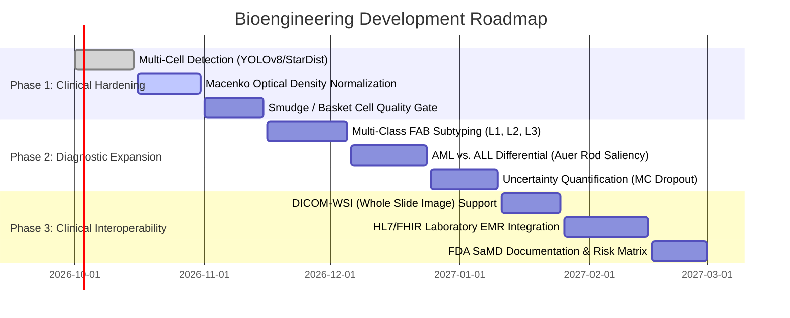

# 🧬 Bioengineering Evaluation & Technical Backlog: HemaVision AI

**Role Perspective:** Senior Biomedical Engineer & Computational Cytopathologist  
**Project:** Automated Leukemia Cytometry & Decision Support Engine (HemaVision AI)  
**Standard Benchmarks:** ISO 13485 (Medical Devices), IEC 62304 (Medical Device Software), FDA SaMD (Software as a Medical Device)

---

## 1. Executive Bioengineering Audit

The current implementation of HemaVision AI establishes a solid foundation by combining **Transfer Learning (MobileNetV3)** with **Explainable AI (Grad-CAM)**, **Morphometric Biomarkers (N:C Ratio)**, and **Structured Reporting**. 

However, from a biomedical engineering standpoint, bridging the gap from a **controlled academic prototype** to a **clinical-grade diagnostic companion** requires addressing several critical hematological and algorithmic challenges.

```
Current Maturity: TRL 4 (Component Validation in Laboratory Environment)
Target Maturity:  TRL 7 (System Prototype Demonstration in Operational Environment)
```

---

## 2. Critical Bioengineering Gaps & Vulnerabilities

### A. The "Single-Cell Cropping" Assumption (Microscopy vs. Reality)
* **Current State:** The system assumes a pre-segmented, centralized single white blood cell.
* **Clinical Reality:** Under a 100x oil immersion high-power field (HPF), peripheral blood smears contain hundreds of overlapping Red Blood Cells (RBCs), fragmented platelets, smudge cells (basket cells caused by lymphoblast fragility during slide preparation), and mixed leukocyte lineages (neutrophils, eosinophils, monocytes).
* **Risk:** The model cannot yet process full field-of-view (FOV) or Whole Slide Images (WSI) without prior manual cropping.

### B. Biological False Positive Hazards (The "Reactive Lymphocyte" Confounder)
* **Current State:** Binary classification: `Normal Lymphocyte` vs. `ALL Blast Cell`.
* **Clinical Reality:** In infectious mononucleosis (Epstein-Barr virus) or severe viral infections, benign immune systems produce **Downey cells (reactive/atypical lymphocytes)**. These cells enlarge, exhibit irregular chromatin, and display elevated N:C ratios that closely mimic malignant lymphoblasts.
* **Risk:** A pure binary classifier trained without reactive lymphocyte negative controls will produce false positive alarms on viral infection smears.

### C. Differential Diagnosis: ALL vs. AML & Auer Rods
* **Current State:** Detects Acute Lymphoblastic Leukemia (ALL).
* **Clinical Reality:** Hematologists must distinguish ALL from **Acute Myeloid Leukemia (AML)**. A hallmark cytological feature of AML is the presence of **Auer rods** (needle-shaped cytoplasmic inclusions formed from coalesced azurophilic granules).
* **Risk:** Treating AML as ALL or vice-versa leads to catastrophic treatment mismatches (different induction chemotherapy regimens).

### D. Slide Preparation & Staining Variability (Laboratory Domain Shift)
* **Current State:** Reinhard statistical stain normalization.
* **Clinical Reality:** Fixation techniques (methanol vs. ethanol), pH buffering differences (pH 6.8 vs. 7.2), dye manufacturer lots, and scanner optical sensors create significant spectral domain shifts.
* **Improvement:** Needs **Macenko Optical Density Color Deconvolution** to isolate pure hematoxylin/methylene blue vs. eosin dye vectors.

---

## 3. Prioritized Bioengineering Product Backlog



### 🔴 P0 (Critical - Must-Have for Clinical Defense & Thesis)

| ID | Feature / Bioengineering Task | Clinical Rationale | Implementation Approach |
| :--- | :--- | :--- | :--- |
| **BIO-01** | **Automated Multi-Cell WSI Detection & Tiling** | Real blood smears have multiple cells per slide; manual cropping is non-viable. | Train a lightweight **YOLOv8-nano or StarDist** instance segmentation model on blood smears to detect, count, and crop every WBC automatically. |
| **BIO-02** | **Macenko Optical Density Color Deconvolution** | Reinhard normalization only balances RGB statistics; optical density physics models Beer-Lambert light absorption. | Separate RGB into independent stain vectors using SVD (Singular Value Decomposition) on Optical Density space: $OD = -\log_{10}(I/I_0)$. |
| **BIO-03** | **Uncertainty Quantification & "Reject" Option** | Medical AIs must never give a high-confidence guess on corrupted slides or air bubbles. | Implement **Monte Carlo Dropout** or **Evidential Deep Learning** to output epistemic uncertainty; route high-uncertainty cells to "Manual Pathologist Review". |
| **BIO-04** | **Smudge / Damaged Cell Quality Filter** | Blast cells are physically fragile and burst into "basket cells" during smear dragging. | Add a morphological integrity pre-filter to detect lysed cell remnants and exclude them from scoring to prevent false metrics. |

---

### 🟡 P1 (Important - High Academic & Research Impact)

| ID | Feature / Bioengineering Task | Clinical Rationale | Implementation Approach |
| :--- | :--- | :--- | :--- |
| **BIO-05** | **FAB (French-American-British) ALL Subtyping** | WHO/FAB stratifies ALL into L1 (small, homogenous), L2 (large, heterogeneous pleomorphic), and L3 (Burkitt-type with prominent vacuoles). | Extend model head to a 4-class taxonomy: `Normal`, `ALL-L1`, `ALL-L2`, `ALL-L3`. |
| **BIO-06** | **Auer Rod & Granule Detector (ALL vs. AML)** | Pathologists check for cytoplasmic Auer rods to rule out Acute Myeloid Leukemia before confirming ALL. | High-resolution crop inspection using targeted edge/contrast feature detectors tuned for needle-like crystalline inclusions in cytoplasm. |
| **BIO-07** | **Vision Transformer (ViT) Hybrid Attention** | CNNs capture local textures; Transformers capture global chromatin spatial relationships. | Benchmark MobileNetV3 against **Swin-Transformer / EfficientNetV2** and fuse feature embeddings. |
| **BIO-08** | **Patient-Level Aggregation (Differential Count)** | Clinical diagnosis is never based on 1 single cell; it requires a complete 100-cell differential (blast percentage $\ge 20\%$). | Aggregate all segmented leukocytes per patient smear to calculate: $$\text{Blast \%} = \frac{N_{\text{blast}}}{N_{\text{total WBC}}} \times 100$$ Alert when Blast $\% \ge 20\%$. |

---

### 🟢 P2 (Future-Proofing - Clinical Deployment & Regulatory)

| ID | Feature / Bioengineering Task | Clinical Rationale | Implementation Approach |
| :--- | :--- | :--- | :--- |
| **BIO-09** | **DICOM Supplement 145 / WSI File Ingestion** | Hospital digital pathology scanners export Whole Slide Images in `.svs`, `.ndpi`, or DICOM formats. | Integrate `OpenSlide` / `tifffile` with pyramidal multi-resolution zooming. |
| **BIO-10** | **HL7 / FHIR Laboratory Interface** | Automated EHR integration to automatically push diagnostic reports to Hospital Information Systems (HIS). | Add FastAPI REST endpoints adhering to the **HL7 FHIR DiagnosticReport** schema. |
| **BIO-11** | **ISO 14971 Risk Management & Hazard Analysis** | Regulatory mandate for medical software devices (IEC 62304 / FDA SaMD). | Compile failure mode and effects analysis (FMEA) for false negatives, microscope blur, and stain fading. |

---

## 4. Bioengineering Viva Questions & Scoring Matrix

When defending this project before biomedical engineering and medical faculty, expect these questions:

### 1. "How do you handle the 20% WHO Diagnostic Threshold?"
* **Answer:** *"According to WHO guidelines, Acute Leukemia is formally defined by $\ge 20\%$ lymphoblasts or myeloblasts among total nucleated bone marrow or peripheral blood cells. Our pipeline's roadmap incorporates patient-level differential cell pooling: rather than rendering a diagnosis on a single isolated lymphocyte, the system segments all WBCs across the slide, computes the blast fraction, and triggers high-risk alerts when the count exceeds 20%."*

### 2. "Why is Reinhard Stain Normalization insufficient for clinical histology?"
* **Answer:** *"Reinhard normalization operates in Lab color space by shifting mean and standard deviations of color channels. However, light transmission through stained histological tissue obeys the Beer-Lambert Law: $I = I_0 e^{-A \cdot C}$. Macenko stain deconvolution solves for the physical absorption matrix of specific dye components (Eosin and Methylene Blue), allowing us to computationally restain or standardize slides according to physical absorption physics rather than heuristic pixel statistics."*

### 3. "How would you prevent the model from misdiagnosing Epstein-Barr Virus (EBV) reactive lymphocytes?"
* **Answer:** *"EBV induces reactive CD8+ T-cells (Downey cells) with copious scalloped cytoplasm that indents around neighboring erythrocytes. We resolve this by incorporating computational morphology alongside deep learning: reactive lymphocytes maintain a lower N:C ratio ($<0.65$) with prominent cytoplasmic margins, whereas ALL lymphoblasts possess an extremely high N:C ratio ($>0.80$) with a thin, unindented cytoplasmic rim."*
